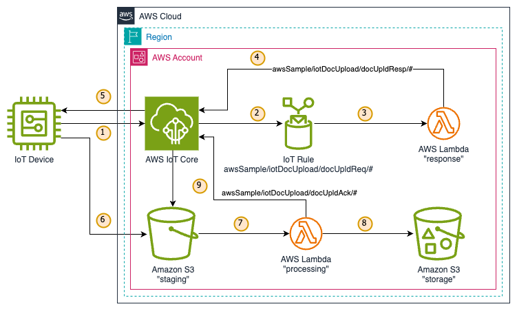

# Secure S3 File Upload For Iot Device Cloud Infrastructure deployment

## Overview
This CDK application deploys AWS cloud resources enabling the capability for an IoT device to securely upload documents
to Amazon S3.

## Deployment
This CDK deploys a single AWS CloudFormation stack called `S3FileUploadForIoT`.

### Pre-requisites
* Node.js version 18.x or above, as supported by the current version of aws-cdk (tested with 18.19)
* Python (tested with 3.12)
* You have fresh credentials to the target AWS Account

### Install dependencies

```bash
# Install the AWS CDK and the dependencies with Node.js
npm install
# Install the python3 packages required by CDK to generate the CloudFormation template
pip3 install -r requirements.txt
# If new account, you need to bootstrap the CDK (there is no risk to run it regularly...)
cdk bootstrap
```

### Deployment
```bash
# Then deploy the solution on your account
cdk deploy
```

#### Useful CDK commands

* `npm run build`   compile typescript to js
* `npm run watch`   watch for changes and compile
* `npm run test`    perform the jest unit tests
* `npx cdk deploy`  deploy this stack to your default AWS account/region
* `npx cdk diff`    compare deployed stack with current state
* `npx cdk synth`   emits the synthesized CloudFormation template

## Architecture

### CDK Code organization
The code is split in two Constructs:
* `lib/common-resources.ts` regroups resources that might already exist in your account like *S3 Access Logs bucket*
  or *KMS Encryption key*.
* `lib/file-upload.ts` describes the infrastructure for managing the uploads from the IoT Device. It exclusively makes
  of serverless services, including: AWS IoT Code, AWS Lambda and Amazon S3. Logs are directed to Amazon CloudWatch.
* You'll find some documentation source files in the `documentation` directory in case you need to integrate this 
  architecture in your project.

### Architecture Diagram and workflow


#### Workflow:
1. The device sends a request to upload a document on a 'request' MQTT topic.
2. An AWS IoT Rule traps the publication to the upload 'request' topic and invokes a Lambda function.
3. The Lambda function processes the payload, generates an Amazon S3 pre-signed URL
4. The Lambda function publishes a response on a 'response' MQTT topic containing all the information
   necessary for uploading the document to S3. 
5. The device receives the response.
6. The device uploads the document to an Amazon S3 staging bucket via an HTTPS PUT request.
7. The new object created in the S3 staging bucket invokes a Lambda function.
8. The Lambda function processes the uploading document and moves the final document(s) to a Storage bucket.
9. The lambda Function sends an Acknowledgement (success/failure) to an 'ack' MQTT topic.
10. The device receives the acknowledgement on the 'ack' MQTT topic.

### Security aspects
The security of this solution includes the following elements (is not limited to):
* All buckets and Lambda functions are encrypted using a customer MKS key.
* The MQTT connection between the device and the AWS Cloud is encrypted and requires certificates on both sides.
* The pre-signed URL has a limited lifetime, set to the minimum available.
* The device request requires to send an md5 hash of the document it wants to upload. This hash is verified by the 
  Amazon S3 service  before the document is accepted and written in the staging bucket.
* The staging bucket receives the uploaded documents. A Lambda function is in charge of verifying its integrity and
  preprocessing it (e.g. unzip an archive) before moving it to its final destination.
* The IoT policies only allow necessary actions on very specific MQTT topics, applying the principle of least privileges.

### Important implementation details
**Event-driven architecture:**
The different steps of the workflow are triggered by "events", like publication on an MQTT topic or creation of a new
object in the staging S3 bucket. The subsequent steps still need some information from the previous step to continue
the process. This information could be stored in a database table but to avoid having to use an additional AWS service,
this solution uses S3 object metadata and MQTT payloads to ensure continuity in the workflow Steps:
1. The vice sends a UUID with each request, plus other information (see Lambda function code for response). This UUID
   will be repeated in the response so the device can track multiple concurrent requests if necessary.
2. The response also contains the headers the must be used by the device when uploading the document to S3. The reason is 
   that S3 pre-signed URL signature includes the headers and that the S3 object metadata is passed in the headers.
   This metadata will be used when retrieving the uploaded document.
3. When a new object is created in the S3 staging bucket, a Lambda function will retrieve the metadata and process the
   object accordingly.

**Amazon S3 object metadata:**
[Amazon S3 object metadata](https://docs.aws.amazon.com/AmazonS3/latest/userguide/UsingMetadata.html) allow storing 
user-defined information together with an object as sets of key-value pairs. This takes place by setting special headers
during the PUT or POST requests. Amazon S3 stores user-defined metadata in lowercase and recommends to confirm to us-ascii
characters. To avoid putting constraints on developers and devices regarding key and values for the metadata, this
solution encodes the key and value using base16 encoder and forces the characters set to lowercase. This allows supporting
a wider character set for the metadata as well as supporting lowercase and uppercase. The drawback is that the metadata
is not directly human-readable from the S3 API or console.


